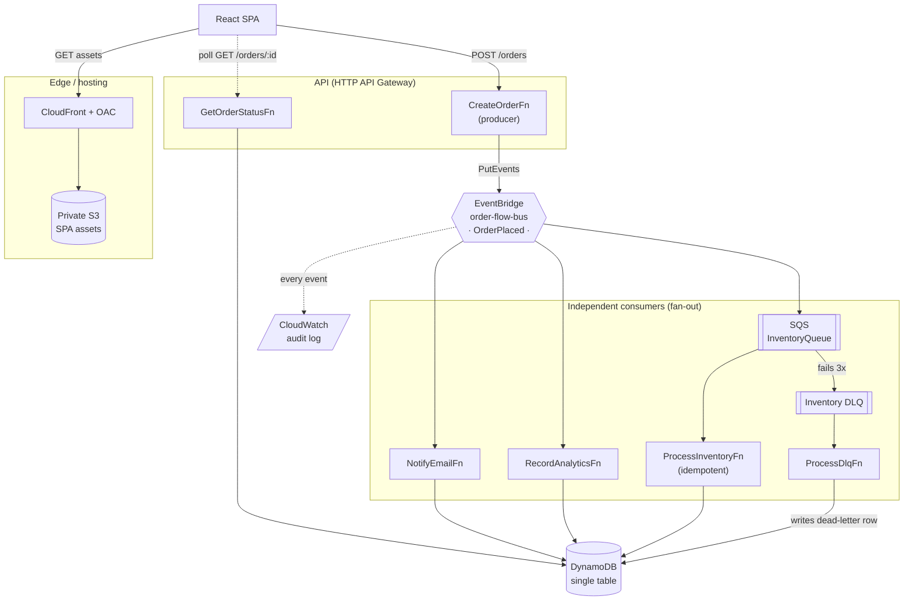

# Order flow

An event-driven serverless order pipeline on AWS, built entirely in CDK. One order becomes one event, and three independent consumers react to it: email, analytics, and inventory. The inventory path runs through an SQS queue with a dead-letter queue, so a failing message is retried and then captured instead of lost.

[](https://github.com/johncarlobartolome-cynn/order-flow/actions/workflows/deploy.yml)

**Live demo:** https://d2xs1924mdmylw.cloudfront.net

Place an order and watch the fan-out react in real time. Tick "Force inventory failure" to send the inventory message through its retries and into the DLQ, then watch the badge flip to `DLQ` when the message actually lands there (not on a timer, see [the DLQ signal](#the-dlq-is-not-a-graveyard) below).

## Why this exists

A portfolio piece for a Senior AWS Full-Stack role, focused on the parts a CRUD app never exercises: asynchronous fan-out, message buffering, poison-message handling, idempotency under at-least-once delivery, and keyless CI/CD. Everything is infrastructure-as-code and deploys from a single `cdk deploy`.

## Architecture



### The flow

1. The SPA (served from a private S3 bucket via CloudFront with Origin Access Control) `POST`s an order to the HTTP API.
2. The producer Lambda validates it and publishes one `OrderPlaced` event to a custom EventBridge bus.
3. The bus fans out to three consumers, each subscribing independently:
   - **Email** and **analytics** are direct Lambda targets; each writes its own status row. Email is intentionally mocked: it records that it reacted rather than sending real mail, since the point here is the fan-out, not delivery (wiring SES would be a small, deliberate next step).
   - **Inventory** goes through an **SQS queue** first, so its failures can be retried and buffered rather than dropped.
4. An audit rule mirrors every event to CloudWatch Logs.
5. The SPA polls `GET /orders/{id}` and shows each consumer's real state.

## Design decisions worth calling out

### The inventory worker is idempotent
SQS is at-least-once, so a message can be delivered more than once, and a partial failure can re-run a handler that already did some of its work. A naive `stock -= qty` would double-decrement. Instead the worker does one atomic `TransactWriteItems`: a conditional `Put` of the `STATUS#inventory` row (guarded by `attribute_not_exists`) plus the stock decrements, all-or-nothing. A duplicate delivery fails the condition and the whole transaction aborts, so reprocessing is a no-op.

### The DLQ is not a graveyard
Most demos show a message landing in a DLQ and stopping there. Here the **DLQ has its own consumer** (`ProcessDlqFn`) that writes a real `STATUS#inventory { status: 'dead-letter' }` row when a message is genuinely exhausted (received `maxReceiveCount` times). The UI reads that real row, so the "DLQ" badge reflects what AWS actually did, not a client-side timer. This closes the full lifecycle: order placed, retried, dead-lettered, observed.

### Keyless CI/CD (GitHub OIDC, no stored secrets)
GitHub Actions assumes an IAM role via OIDC, so there are no long-lived AWS keys anywhere. The trust policy pins the exact repository and the `main` branch. On this account, GitHub injects immutable numeric IDs into the token subject (`repo:<owner>@<ownerId>/<repo>@<repoId>:ref:refs/heads/main`), so the trust matches that ID form rather than the textbook `repo:owner/repo`.

### The UI tells the truth
State is derived only from real status rows, never from elapsed time. While inventory is still working through its retries, the card shows an honest `processing` state (the order was accepted and the fast consumers finished, so inventory is genuinely still on the queue), and only flips to `DLQ` once the dead-letter row exists.

## Tech stack

| Area | Choice |
|---|---|
| IaC | AWS CDK (TypeScript) |
| Compute | Lambda (Node.js 22, `NodejsFunction`) |
| Messaging | EventBridge (custom bus + rules), SQS + DLQ |
| Data | DynamoDB (single-table, `PAY_PER_REQUEST`) |
| API | API Gateway HTTP API |
| Web | React + Vite + TypeScript, hosted on S3 + CloudFront (OAC) |
| CI/CD | GitHub Actions with OIDC (keyless) |
| Region | `ap-southeast-1` |

## Data model (single table)

| Purpose | PK | SK | Notes |
|---|---|---|---|
| Consumer status | `ORDER#<id>` | `STATUS#<consumer>` | one row per consumer; inventory failures write `status: dead-letter` |
| Stock | `PRODUCT#<sku>` | `STOCK` | decremented atomically by the inventory worker |

## API

| Method | Path | Body / result |
|---|---|---|
| `POST` | `/orders` | `{ items: [{ sku, qty }], customerEmail, forceFailure? }` → `202 { orderId }` |
| `GET` | `/orders/{id}` | `{ orderId, statuses: { email, analytics, inventory } }` |

## Testing (a full pyramid)

| Layer | Tool | What it covers |
|---|---|---|
| Unit | Jest + `aws-sdk-client-mock` | each Lambda handler in isolation (idempotency, dead-letter write, malformed-event handling) |
| Infrastructure | `aws-cdk-lib/assertions` | the synthesized template: private bucket + OAC, least-privilege IAM, the DLQ consumer is wired to the DLQ, queue/DLQ config |
| End-to-end | deployed `e2e/e2e.sh` | places a real order, asserts the fan-out reaches all three consumers, then forces a failure and asserts the real `dead-letter` row appears |

The E2E runs in CI on every push to `main`, after the unit and infrastructure tests gate the deploy.

## Project layout

```
bin/            CDK app entry
lib/            the stack (all infrastructure)
lambda/         handlers: create-order, notify-email, record-analytics,
                process-inventory, process-dlq, get-order-status
test/           Jest unit + CDK assertion tests
e2e/            deployed end-to-end test
web/            React + Vite SPA (the demo surface)
.github/        the OIDC deploy pipeline
```

## Known limitations (deliberate scope)

Conscious trade-offs for a focused demo, not oversights:

- **No API authorizer.** The endpoints are open; auth was scoped out. The event payload (including `customerEmail`) lands in the short-retention audit log by design.
- **Email consumer is mocked.** It records that it reacted rather than sending real mail; wiring SES is a small, deliberate next step.
- **Only the inventory path has a DLQ.** Email and analytics are direct EventBridge targets, where EventBridge's own retry applies; the inventory path is where the buffered-worker plus DLQ pattern is demonstrated.
- **No oversell guard.** Stock can go negative under contrived input; a conditional-write floor is straightforward to add but out of scope here.
- **Single-deploy naming.** A few resources use fixed names for readability, so two copies of the stack can't run side by side in one account.
- **Demo-scale orders.** Orders are small: the DynamoDB transaction has a 100-item ceiling and per-order SKUs are assumed distinct.

## Run it yourself

Prerequisites: Node.js, the AWS CDK, and AWS credentials for an account bootstrapped for CDK (`cdk bootstrap`).

```bash
npm ci                 # install
npm test               # unit + CDK assertion tests

# build the SPA so the deploy uploads it (needs the API URL)
cd web && npm ci && VITE_API_URL="<your-api-url>" npm run build && cd ..

npm run cdk deploy     # deploy the whole stack; note the SiteUrl + ApiUrl outputs
npm run test:e2e       # run the end-to-end test against the deployed stack
```

On the first deploy the API URL isn't known yet, so deploy once to get the `ApiUrl` output, build the SPA with it, then deploy again. In CI this is a single pass because the API URL is stored as a repository variable.

## Teardown

Everything uses `RemovalPolicy.DESTROY` and the site bucket auto-deletes its objects, so the stack tears down cleanly:

```bash
npm run cdk destroy
```
